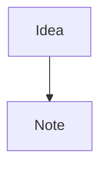

# Additional Syntax

> Use Obsidian-supported Markdown extensions for emphasis, comments, math, footnotes, diagrams, and tasks.

## Inline Syntax

| Syntax | Result |
|--------|--------|
| `==highlighted==` | Highlighted text |
| `%%hidden comment%%` | Comment hidden in reading view |
| `$e = mc^2$` | Inline LaTeX math |
| `~~strikethrough~~` | Strikethrough text |

Use comments for authoring notes, not durable knowledge. Comments are easy to miss in reading view.

## Block Syntax

```markdown
$$
\sum_{i=1}^{n} x_i
$$
```

Block math should be on its own lines.

## Footnotes

```markdown
A cited sentence.[^1]

[^1]: Citation or explanatory note.
```

Prefer footnotes for citations or supporting detail. Use wikilinks in footnotes when citing other notes.

## Mermaid Diagrams

````markdown

````

Keep diagrams small enough to maintain in source mode. For complex diagrams, embed an image or link to the source file.

## Tasks

```markdown
- [ ] Incomplete task
- [x] Completed task
- [/] In progress
- [-] Cancelled
```

Obsidian recognises standard Markdown task checkboxes. Custom task states may depend on theme or plugin support, so avoid them unless the vault uses them consistently.
